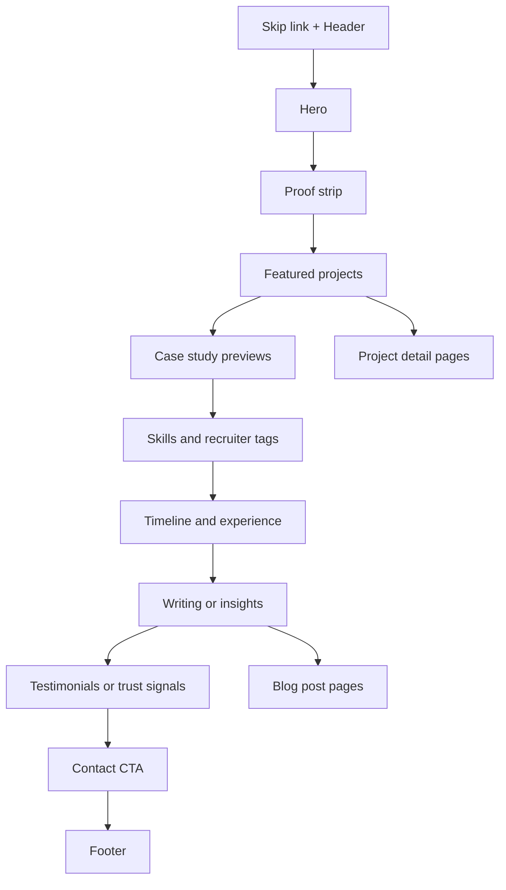

# Landing portfolio de alto impacto para Adley Rodrigues de Castro

## Resumo executivo

Para um **Senior Front-End Developer** como você, a melhor estratégia não é construir “mais um portfólio bonito”, e sim uma **landing page de conversão com profundidade técnica sob demanda**: uma homepage extremamente clara para recrutadores, com **3 estudos de caso fortes**, CTA visível para contato/contratação e páginas internas de projeto capazes de convencer tech leads e CTOs. Isso é consistente com três fatos bem documentados: usuários **escaneiam** páginas em vez de lê-las integralmente, o valor da homepage precisa ficar claro **em segundos**, e um bom portfólio funciona como guia para mostrar o trabalho “na melhor luz possível” a potenciais empregadores. citeturn13search1turn13search17turn13search4turn22view0

A recomendação central deste relatório é a seguinte:  
**home única + páginas profundas de case study + branding técnico sóbrio + performance e acessibilidade como prova prática da sua senioridade**. Em vez de dezenas de cards, use um “highlight reel” com **2 a 5 projetos no total** e destaque **3 na homepage**, como recomenda Josh Comeau. Para um perfil sênior, complemente isso com **escrita curta** sobre decisões técnicas, porque, para mostrar “coding skills” e valor profissional, prova de trabalho costuma funcionar melhor do que listas genéricas de buzzwords. citeturn22view0turn22view1

Se eu tivesse que resumir em uma decisão de produto, seria esta:

- **Objetivo primário:** gerar contato qualificado e entrevista.  
- **Objetivo secundário:** demonstrar stack, senioridade e clareza técnica.  
- **Objetivo terciário:** reforçar autoridade com cases, escrita e sinais públicos de credibilidade.  
- **Stack recomendada:** **Next.js + TypeScript + Tailwind CSS + MDX + Vercel + GitHub Actions + Vercel Speed Insights + Plausible/Umami**, porque isso combina sinal forte de React/Front-End com SEO, shareability, automação e observabilidade simples. citeturn26view0turn26view1turn26view2turn26view5turn26view10turn26view11turn26view12

## Referências e princípios para recrutadores, tech leads e CTOs

### O que cada público precisa ver

**Recrutadores** precisam validar rápido: “quem é”, “o que faz”, “stack principal”, “senioridade”, “domínio de negócio” e “como entrar em contato”. Como usuários da web escaneiam páginas e leem apenas uma fração do texto, o topo da página precisa entregar essa resposta sem esforço. citeturn13search1turn13search9turn13search17turn13search4

**Tech leads** procuram sinais de execução: decisões, trade-offs, arquitetura, qualidade de UI, acessibilidade, performance, testes e clareza de responsabilidades. Josh Comeau destaca que o portfólio ideal atua como um “tour guide”, conduzindo a pessoa por uma exploração mais profunda do projeto. citeturn22view0

**CTOs** procuram amplitude e risco: impacto, autonomia, liderança, capacidade de simplificar complexidade, comunicação e entendimento de negócio. A distinção que swyx faz entre “business value” e “coding skills” é muito útil aqui: o seu site precisa mostrar os dois, mas em camadas diferentes. A homepage comunica valor; os case studies mostram profundidade. citeturn22view1

### Lista priorizada de referências reais

A lista abaixo está ordenada pelo quanto cada referência é útil **para o seu objetivo específico** — ser contratado como sênior front-end/React com credibilidade técnica.

| Referência | Por que funciona | Uso prático para você | Fonte |
|---|---|---|---|
| **Brittany Chiang** | Estrutura quase “ouro padrão”: headline objetiva, About forte, Experience escaneável, Projects claros, tags de stack e CTA de currículo. | Excelente modelo-base para homepage de contratação. | citeturn21view0 |
| **Paco Coursey** | Posicionamento curto e sofisticado, projetos com descrição mínima porém forte, escrita e seção “Now” que humaniza sem poluir. | Ótimo para calibrar tom sênior, craft e foco. | citeturn21view4 |
| **Sarah Drasner** | Une autoridade, multipotencialidade e contato direto: writing, speaking, projects e form. | Boa referência para combinar carreira, autoridade e proximidade. | citeturn21view5 |
| **Lee Robinson** | Minimalismo radical: uma frase, foco em writing, code e follow. Altíssimo sinal/ruído. | Excelente para aprender o que cortar. | citeturn21view1 |
| **Max Böck** | Personalidade visual sem perder legibilidade, conteúdo técnico em destaque, navegação simples. | Inspiração para adicionar personalidade sem quebrar UX. | citeturn21view2 |
| **Rauno Freiberg** | Manifesto visual curtíssimo e memorável, identidade forte de craft. | Útil para lapidar o tom do hero. | citeturn21view3 |
| **swyx** | Forte “personal brand”, escrita e canalização clara da própria tese profissional. | Excelente referência para posicionamento e autoridade pública. | citeturn22view4turn22view1 |
| **Manu Arora** | Social proof forte com empresas, CTA comercial claro (“Work with me”), escrita e transparência de código. | Bom modelo para seção de prova social e CTA. | citeturn22view2 |
| **Jason Lengstorf** | Boa combinação de branding pessoal, serviços, conteúdo e media kit. | Referência útil se quiser abrir espaço para consultoria, talks ou conteúdo. | citeturn15search1 |
| **Bruno Simon** | Extremamente memorável e diferenciador; mostra domínio técnico e criatividade radical. | Use como inspiração de “delight”, mas **não** como modelo principal de conversão para recrutadores. | citeturn21view6turn13search2 |

### Princípios de UX e visual design

A melhor homepage para carreira é a que comunica **“quem sou, o que faço e por que sou relevante”** imediatamente. NN/g recomenda uma homepage que comunique claramente propósito e proposta de valor, e reforça que hierarquia visual depende de **contraste, escala, agrupamento e cor**. citeturn13search4turn13search3turn13search7

Para a camada visual, vale ancorar sua UI em regras de design system maduras:

- **Tipografia:** use poucos níveis de tamanho, peso claro para corpo e contraste forte entre heading e body; evite caps desnecessário e truncamento de informação importante. Atlassian também recomenda linha de texto em torno de **60–80 caracteres** para legibilidade. citeturn24view0
- **Espaçamento:** use uma escala consistente e agrupe por similaridade/proximidade. Atlassian e Carbon enfatizam que espaçamento e grid ajudam o usuário a escanear e entender relações sem esforço. citeturn24view1turn24view2
- **Grid:** Carbon usa o mini-unit de **8 px** como base e destaca a importância de key lines, padding consistente e teste em breakpoints padrão. citeturn24view2

### Inventário de componentes

| Componente | Prioridade | Função |
|---|---|---|
| Header com navegação curta | Essencial | Orientação + acesso a projetos/contato |
| Skip link | Essencial | Acessibilidade por teclado |
| Hero com headline, subhead e 2 CTAs | Essencial | Converter em 5–10 segundos |
| Proof strip | Essencial | Stack, anos, domínio, cargo-alvo |
| Featured Projects | Essencial | Mostrar relevância rapidamente |
| Case study previews | Essencial | Conectar homepage à profundidade técnica |
| Skills/Tags | Essencial | Recrutadores e filtros |
| Timeline/Experience | Essencial | Progressão de carreira |
| Contact section | Essencial | Conversão |
| Resume download | Essencial | Atalho para triagem |
| Testimonials / trust | Opcional forte | Reforço social |
| Blog / writing | Opcional estratégico | Autoridade e SEO |

## Arquitetura da informação e wireframes

### Arquitetura sugerida

A melhor arquitetura para você é **landing primeiro, profundidade depois**. Não recomendo começar com um site “multissistema”. Recomendo uma homepage de contratação e apenas algumas páginas profundas de case study. Isso preserva clareza para recrutadores e permite profundidade suficiente para quem quiser validar senioridade. Essa abordagem segue diretamente o princípio de highlight reel de Josh Comeau e a noção de prova de trabalho defendida por swyx. citeturn22view0turn22view1

### Sitemap recomendado

| Rota | Objetivo | Observações |
|---|---|---|
| `/` | Landing principal | Hero, proof, projetos, timeline, contato |
| `/projetos` | Índice curto de projetos | Até 5 itens no total |
| `/projetos/fitbank-onboarding-kpi` | Case study 1 | Projeto com maior impacto/complexidade |
| `/projetos/design-system-ou-dashboard-react` | Case study 2 | Projeto de front-end puro |
| `/projetos/chat-ou-ai-integration` | Case study 3 | Diferencial recente / IA / experiência |
| `/artigos` | Lista de textos | Opcional na v1 |
| `/artigos/[slug]` | Texto individual | Curto e técnico |
| `/curriculo.pdf` | Download | PDF otimizado |
| `/og/*` | Imagens sociais | OG e compartilhamento |
| `/robots.txt` | SEO técnico | Gerado automaticamente |
| `/sitemap.xml` | SEO técnico | Gerado automaticamente |

### Fluxo de seções da página



### Wireframe desktop

```text
┌─────────────────────────────────────────────────────────────────────────────┐
│ Skip to content                                                            │
│ Logo / Name      Projects   About   Writing   Contact   Download CV        │
├─────────────────────────────────────────────────────────────────────────────┤
│ H1: headline forte                                                         │
│ Subhead: quem você é + stack + domínio + senioridade                       │
│ [Ver projetos]   [Baixar currículo]                                        │
│ Chips: React • TypeScript • Acessibilidade • Performance • Fintech         │
│                                  Foto/visual técnico/mini proof panel      │
├─────────────────────────────────────────────────────────────────────────────┤
│ Proof strip: 4+ anos | Fintech/Edtech | React/TS | Liderança técnica       │
├─────────────────────────────────────────────────────────────────────────────┤
│ Featured Projects (3 cards)                                                │
│ [Projeto 1] [Projeto 2] [Projeto 3]                                        │
├─────────────────────────────────────────────────────────────────────────────┤
│ Case study preview 1 (contexto + desafio + impacto + CTA)                  │
│ Case study preview 2                                                        │
│ Case study preview 3                                                        │
├─────────────────────────────────────────────────────────────────────────────┤
│ Skills & Tags agrupadas                                                    │
├─────────────────────────────────────────────────────────────────────────────┤
│ Timeline / Experience                                                      │
├─────────────────────────────────────────────────────────────────────────────┤
│ Writing / Insights (3 posts)                                               │
├─────────────────────────────────────────────────────────────────────────────┤
│ Testimonials / Logos / Proof                                               │
├─────────────────────────────────────────────────────────────────────────────┤
│ Contact CTA + email + WhatsApp/LinkedIn/GitHub                             │
├─────────────────────────────────────────────────────────────────────────────┤
│ Footer                                                                     │
└─────────────────────────────────────────────────────────────────────────────┘
```

### Wireframe mobile

```text
┌──────────────────────────────┐
│ Skip link                    │
│ Menu / CV                    │
├──────────────────────────────┤
│ Headline                     │
│ Subhead                      │
│ [Ver projetos]               │
│ [Baixar currículo]           │
│ Chips                        │
├──────────────────────────────┤
│ Proof strip                  │
├──────────────────────────────┤
│ Projeto 1                    │
│ Projeto 2                    │
│ Projeto 3                    │
├──────────────────────────────┤
│ Case study previews          │
├──────────────────────────────┤
│ Skills / Tags                │
├──────────────────────────────┤
│ Timeline                     │
├──────────────────────────────┤
│ Writing                      │
├──────────────────────────────┤
│ Testimonials / Proof         │
├──────────────────────────────┤
│ Contact                      │
├──────────────────────────────┤
│ Footer                       │
└──────────────────────────────┘
```

### Comportamento responsivo

A estrutura deve ser **mobile-first**, com foco em um fluxo de leitura linear. Use **1 coluna no mobile**, **8 colunas no tablet** e **12–16 colunas no desktop**, mantendo alinhamento, key lines e ritmo vertical. Carbon recomenda grid fluido, padding consistente e teste em breakpoints padrão; em mobile, compacte o conteúdo, mas **não esconda** informação principal atrás de interações desnecessárias. citeturn24view2turn13search2

## Conteúdo, copy e estudos de caso

### Hero variants com copy exata

#### Variante concisa

**Headline**  
**Senior Front-End Developer construindo produtos React rápidos, acessíveis e orientados a negócio.**

**Subhead**  
Sou **Adley Rodrigues de Castro**. Atuo com **React, TypeScript e arquitetura front-end** em produtos de alta complexidade, com base full-stack, experiência em **fintech** e histórico de **liderança técnica**.

**CTA primário**  
**Ver projetos**

**CTA secundário**  
**Baixar currículo**

#### Variante narrativa

**Headline**  
**Transformo complexidade de produto em interfaces claras, rápidas e confiáveis.**

**Subhead**  
Nos últimos anos trabalhei entre **produto, arquitetura e front-end**, entregando dashboards, fluxos críticos e experiências web para contextos exigentes. Meu foco é unir **clareza de UX, código escalável e impacto real no negócio**.

**CTA primário**  
**Explorar estudos de caso**

**CTA secundário**  
**Falar comigo**

#### Variante técnica

**Headline**  
**React, TypeScript, design systems, performance e arquitetura front-end com visão de produto.**

**Subhead**  
Experiência prática em **componentização, acessibilidade, Web Vitals, integrações, CI/CD e liderança técnica**, com histórico em **produtos financeiros e plataformas web de alta complexidade**.

**CTA primário**  
**Ver arquitetura dos projetos**

**CTA secundário**  
**Abrir currículo**

### Copy recomendado para seções

#### Proof strip

**4+ anos em software • React/TypeScript • Fintech e produtos web complexos • Liderança técnica**

#### Intro de projetos

**Projetos em que precisei equilibrar experiência do usuário, complexidade técnica e resultado de negócio.**

#### Intro de timeline

**Da base full-stack em fintech à atuação focada em front-end sênior, arquitetura e liderança técnica.**

#### Intro de writing

**Notas curtas sobre decisões de front-end, arquitetura e qualidade de produto.**

#### Seção de contato

**Se você procura alguém para elevar a camada front-end sem perder pragmatismo de produto, vamos conversar.**

### Microcopy para CTAs

| Situação | CTA | Microcopy |
|---|---|---|
| Hero principal | **Ver projetos** | Veja os 3 cases que melhor representam meu trabalho |
| Hero secundário | **Baixar currículo** | PDF atualizado com stack, experiência e contato |
| Card de projeto | **Ver estudo de caso** | Contexto, decisões, stack e impacto |
| Contato | **Falar comigo** | Respondo com agilidade para oportunidades sérias |
| Resume | **Abrir PDF** | Versão enxuta para recrutadores |
| Blog | **Ler insight** | 3–5 minutos de leitura |

### Template de About

**Sou Adley Rodrigues de Castro, Desenvolvedor Front-End Sênior com base full-stack e mais de 4 anos de experiência em produtos web de alta complexidade. Já atuei em contextos financeiros e educacionais, liderando iniciativas de front-end, definindo soluções técnicas e evoluindo interfaces com foco em clareza, performance e manutenção.**

**Hoje minha atuação é centrada em React, TypeScript, JavaScript, HTML, CSS, arquitetura de componentes, acessibilidade e qualidade de experiência. Minha base full-stack me ajuda a tomar decisões melhores de integração, dados e entrega. Gosto de transformar requisitos ambíguos em interfaces consistentes, escaláveis e compreensíveis para usuário, time e negócio.**

### Três templates de estudo de caso

#### Versão curta

Use na homepage ou em cards expandidos.

**Estrutura**
- Contexto
- Desafio
- Meu papel
- Stack
- O que eu fiz
- Resultado
- Links

**Template**
> **Contexto:** [tipo de produto / empresa / cenário]  
> **Desafio:** [problema principal]  
> **Meu papel:** [responsabilidade real]  
> **Stack:** [React, TS, etc.]  
> **Solução:** [1–2 decisões principais]  
> **Resultado:** [métrica, eficiência, redução de risco, clareza, tempo]  
> **Links:** [GitHub / demo / imagens / artigo]

**Artefatos obrigatórios**
- 1 screenshot boa
- 1 frase de impacto
- 1 resultado mensurável
- Link de código ou explicação de por que não pode ser público

#### Versão média

Use na página de projeto padrão.

**Estrutura**
- Resumo executivo
- Contexto e restrições
- Papel e escopo
- Problema
- Abordagem
- Decisões técnicas
- Trade-offs
- Resultado
- Aprendizados
- Links e anexos

**Artefatos obrigatórios**
- Screenshots antes/depois ou desktop/mobile
- Stack real
- Métricas
- Diagrama simples de arquitetura
- Lista do que era seu vs. do time

#### Versão longa

Use para 1 ou 2 projetos “âncora”.

**Estrutura**
- Resumo em 30 segundos
- Problema de negócio
- Restrições técnicas e operacionais
- Hipóteses / alternativas consideradas
- Arquitetura adotada
- Detalhes de implementação
- Performance / acessibilidade / DX
- Rollout / validação
- Resultados
- O que faria diferente
- Links

**Artefatos obrigatórios**
- Screenshot hero
- Diagrama de arquitetura
- Timeline de rollout
- Métricas antes/depois
- Link de código, vídeo curtos ou pseudo-código
- Print do Lighthouse/Web Vitals, se fizer sentido
- Se o código for privado: descrição objetiva do módulo, responsabilidades e impacto

### Quantidade ideal de projetos

Mostre **entre 2 e 5 projetos no total** e destaque **3 na homepage**. Projetos demais diluem a atenção e tornam o site menos memorável; o portfólio deve funcionar como **highlight reel**, não como índice de tudo que você já fez. citeturn22view0

### Skills e tags para filtros de recrutadores

#### Títulos-alvo

- Senior Front-End Developer
- Front-End Engineer
- React Developer
- Senior React Engineer
- Software Engineer Front-End
- Full-Stack Developer com foco em Front-End
- Tech Lead Front-End

#### Skills principais

**Core Front-End**  
React, TypeScript, JavaScript, HTML5, CSS3, Next.js, Responsive Design, Accessibility, Web Performance, Component Architecture

**UI Engineering**  
Design Systems, Storybook, Design Tokens, CSS-in-JS, Tailwind CSS, Sass, UI Architecture, Interaction Design

**Performance e Qualidade**  
Core Web Vitals, Lighthouse, Lazy Loading, Image Optimization, Code Splitting, Bundle Optimization, SEO técnico, Testing Library, Jest, Cypress

**Arquitetura e Integração**  
REST APIs, GraphQL, State Management, Microfrontends, Front-End Architecture, CI/CD, GitHub Actions, Azure DevOps

**Base Full-Stack**  
Node.js, .NET, C#, SQL Server, APIs, Authentication, Cloud basics

**Negócio e Liderança**  
Tech Lead, Team Leadership, Product Thinking, Fintech, Payments, Onboarding, KYC, Compliance, B2B SaaS

#### Tags compactas para cards e filtros

React • TypeScript • Next.js • JavaScript • HTML5 • CSS3 • Accessibility • Performance • Design Systems • Storybook • Web Vitals • SEO • APIs • CI/CD • Azure DevOps • GitHub Actions • Fintech • Tech Lead • Full-Stack Base

### Contact email template

Este é o template que eu colocaria como base de um `mailto:` ou botão “Copiar e-mail”.

**Assunto**  
**Oportunidade — Front-End Sênior / React**

**Corpo**
```text
Olá, Adley.

Meu nome é [nome] e falo em nome de [empresa].

Estamos avaliando seu perfil para uma oportunidade com foco em [front-end / React / liderança / arquitetura].

Contexto resumido:
- Produto / time:
- Modelo de contratação:
- Faixa:
- Stack principal:
- Expectativa para a função:
- Prazo do processo:

Se fizer sentido, gostaria de alinhar uma conversa.

Atenciosamente,
[nome]
[empresa]
[contato]
```

### Metadados recomendados para o currículo em PDF

| Campo | Valor recomendado |
|---|---|
| Nome do arquivo | `Adley-Rodrigues-de-Castro-Senior-Frontend-Developer.pdf` |
| Title | `Adley Rodrigues de Castro — Senior Front-End Developer` |
| Author | `Adley Rodrigues de Castro` |
| Subject | `Currículo profissional de Senior Front-End Developer com foco em React e TypeScript` |
| Keywords | `React, TypeScript, Front-End, Senior, JavaScript, Next.js, Accessibility, Performance, Fintech, Tech Lead` |
| Language | `pt-BR` |
| Versão secundária | `Adley-Rodrigues-de-Castro-Senior-Frontend-Developer-EN.pdf` |

## Stack, SEO, analytics e implementação

### Stack recomendada

#### Recomendação final

Se o objetivo principal é **ser percebido como sênior em React/Front-End**, eu recomendo **Next.js App Router + TypeScript + Tailwind CSS + MDX + Vercel**. O motivo é simples: Next oferece **metadata, OG, imagens, fontes, robots e sitemap** de forma nativa; Vercel oferece preview deploys, analytics e speed insights integrados; e isso reduz muito o custo de montar uma landing realmente boa e auditável. citeturn26view0turn26view1turn26view2turn26view3turn26view4turn26view5turn26view6

#### Comparativo de framework e bundler

| Opção | Melhor uso | Prós | Contras | Fonte |
|---|---|---|---|---|
| **Next.js + TypeScript** | Melhor equilíbrio geral para seu caso | Excelente sinal para o mercado React; metadata/OG, images, fonts, robots e sitemap nativos | Mais convenções e mais moving parts que uma SPA simples | citeturn26view0turn26view1turn26view2turn26view3turn26view4 |
| **Astro + React islands** | Melhor se conteúdo e performance forem prioridade máxima | Conteúdo-first, ótimo para sites performáticos e blog com collections tipadas | Menos “sinal React puro” para quem quer ver profundidade em ecossistema React | citeturn26view7turn26view8 |
| **Vite + React** | Melhor para simplicidade e controle manual | Lean, rápido no dev, arquitetura simples | SEO/shareability e routing/meta acabam mais manuais | citeturn26view9 |

### Hospedagem e CI/CD

| Plataforma | Quando escolher | Vantagens | Limites práticos | Fonte |
|---|---|---|---|---|
| **Vercel** | Se usar Next.js | Speed Insights, Web Analytics, previews e boa integração | Menos neutro se quiser total independência de vendor | citeturn26view5turn26view6 |
| **Cloudflare Pages** | Se quiser edge, Workers e ecossistema Cloudflare | Deploy global, Functions, rollbacks, integração com R2/D1/Turnstile/Images | Curva ligeiramente maior para ecossistema | citeturn28view0turn29view0turn29view1 |
| **Netlify** | Se quiser Git workflow + previews + CDN em framework diverso | Global CDN, colaboração, previews, segurança sem infra | Hoje a narrativa da plataforma é mais ampla e menos minimalista | citeturn28view1 |
| **GitHub Pages** | Se quiser portfólio estático simples e barato | Hosting direto do repositório, ótimo para CV/blog simples | Mais limitado para funções dinâmicas, formulários e ecossistema | citeturn28view2turn28view3 |

**CI/CD recomendado:** GitHub Actions rodando lint, type-check, testes, build e Lighthouse CI a cada PR. GitHub Actions é oficialmente uma plataforma de **CI/CD**; Lighthouse pode ser executado via Node/CLI e usado para prevenir regressões. citeturn26view10turn33view4

### Analytics e tracking

#### O que eu recomendaria

- **Plausible** se você quer simplicidade e privacidade.  
- **Umami** se você quer open source/self-host e controle total.  
- **Vercel Web Analytics** se já estiver em Vercel e quiser algo embutido.  
- **GA4** apenas se você realmente precisar de ecossistema amplo de eventos, aquisição e relatórios mais complexos. citeturn26view12turn26view11turn26view6turn27view0

| Ferramenta | Melhor para | Prós | Contras | Fonte |
|---|---|---|---|---|
| **Plausible** | Portfólio simples e privacy-first | Sem cookies, sem dados pessoais, sem banner de consentimento, dashboard simples | Menos profundidade de marketing do que GA4 | citeturn26view12 |
| **Umami** | Open source / self-host | No cookies, no tracking cross-site, sem coleta de dados pessoais, script leve | Exige operação se self-host | citeturn26view11 |
| **Vercel Web Analytics** | Projetos em Vercel | Dados anonimizados, sem cookies, integrado ao dashboard | Mais acoplado à plataforma | citeturn26view6 |
| **GA4** | Funil e ecossistema de eventos mais robusto | Modelo de eventos flexível, enhanced measurement, relatórios amplos | Mais peso operacional e maior cuidado com privacidade/PII | citeturn27view0turn27view1 |

#### Eventos a rastrear

Os eventos abaixo são suficientes para um portfólio de contratação:

- `hero_primary_cta_click`
- `resume_download`
- `project_card_click`
- `case_study_open`
- `contact_email_click`
- `linkedin_click`
- `github_click`
- `contact_form_submit`
- `blog_post_open`
- `scroll_90_home`

Quase toda ferramenta suporta eventos ou métricas customizadas; para Web Vitals em campo, use `web-vitals` e envie como custom metrics/events ao provedor escolhido. citeturn33view7turn33view0

### Imagens, CDN e fontes

| Opção | Melhor uso | Prós | Contras | Fonte |
|---|---|---|---|---|
| **next/image** | Se usar Next.js | Redimensionamento, WebP, lazy loading nativo e prevenção de layout shift | Menos flexível para pipeline avançado de mídia | citeturn26view1 |
| **Cloudflare Images** | Se quiser pipeline gerenciado no edge | AVIF/WebP, responsive sizing, transformação na borda, solução gerenciada | Overkill para poucas imagens | citeturn29view1 |
| **Cloudinary** | Casos com mídia e transformação mais rica | Otimização robusta, formatos, sizing, analytics | Mais pesado para portfólio simples | citeturn29view2 |
| **ImageKit** | Developer-friendly media optimization | Compressão, formato otimizado, resizing, lazy loading | Pode ser mais do que o necessário na v1 | citeturn29view3 |

Para fontes, prefira **self-hosting**. O `next/font` remove requests externos e melhora privacidade e performance, além de ajudar a evitar layout shift. citeturn26view2

### SEO e meta tags

Google recomenda texto de title e meta description que informem e interessem o usuário; também documenta canonicalização, sitemaps e structured data. Para uma página de perfil, o uso de `ProfilePage` com `mainEntity: Person` é apropriado, e o formato recomendado para dados estruturados é **JSON-LD**. citeturn23search2turn23search1turn17search9turn7search3turn7search11turn7search2

#### Meta tags recomendadas

```html
<title>Adley Rodrigues de Castro | Senior Front-End Developer | React & TypeScript</title>
<meta name="description" content="Desenvolvedor Front-End Sênior com base full-stack, experiência em React, TypeScript, arquitetura front-end, acessibilidade, performance e produtos de alta complexidade." />
<link rel="canonical" href="https://seu-dominio.com/" />
<meta property="og:title" content="Adley Rodrigues de Castro | Senior Front-End Developer" />
<meta property="og:description" content="React, TypeScript, arquitetura front-end, acessibilidade, performance e produtos complexos." />
<meta property="og:type" content="website" />
<meta property="og:image" content="https://seu-dominio.com/og/adley-portfolio.png" />
<meta name="robots" content="index,follow,max-image-preview:large" />
```

O Open Graph é o padrão mais importante para compartilhamento social; em Next isso pode ser gerado pela Metadata API junto com favicon e OG image. citeturn16search2turn26view0

#### JSON-LD sugerido

```json
{
  "@context": "https://schema.org",
  "@type": "ProfilePage",
  "mainEntity": {
    "@type": "Person",
    "name": "Adley Rodrigues de Castro",
    "jobTitle": "Senior Front-End Developer",
    "knowsAbout": [
      "React",
      "TypeScript",
      "JavaScript",
      "Accessibility",
      "Web Performance",
      "Front-End Architecture"
    ],
    "sameAs": [
      "https://www.linkedin.com/in/SEU-USUARIO",
      "https://github.com/SEU-USUARIO"
    ]
  }
}
```

### Checklist de implementação

| Área | Tarefas prioritárias | Base |
|---|---|---|
| **Conteúdo** | Definir headline, subhead, 3 projetos, 1 About, timeline, CTA de contato | citeturn22view0turn22view1turn13search4 |
| **Stack** | Subir projeto com Next.js, TypeScript, Tailwind, MDX | citeturn26view0turn26view1turn26view2 |
| **Deploy** | Configurar domínio, preview deploy, CI/CD via GitHub Actions | citeturn26view10turn28view0turn28view1 |
| **Observabilidade** | Habilitar Speed Insights + analytics escolhido + eventos customizados | citeturn26view5turn26view6turn33view7 |
| **SEO** | Title, description, canonical, OG image, sitemap, robots, ProfilePage JSON-LD | citeturn23search1turn23search2turn17search9turn26view3turn26view4turn7search3 |
| **Qualidade** | Lighthouse CI no PR e revisão manual mobile/desktop | citeturn33view4 |

## Acessibilidade, performance, responsividade, animação e segurança

### Checklist de acessibilidade

Acessibilidade aqui não é “compliance simbólico”; ela é parte do argumento de senioridade. Semantic HTML, headings corretos, landmarks, labels, foco evidente e testes por teclado devem aparecer no resultado final — inclusive porque screen readers e outras ATs dependem dessas pistas para navegação. citeturn31view1turn32view2turn32view3turn31view3

| Item | Recomendação | Fonte |
|---|---|---|
| Estrutura principal | Um único `<main>`, fora de `header/nav/footer`; landmarks semânticos | citeturn31view3turn32view3 |
| Cabeçalhos | 1 `<h1>` e hierarquia sem saltos arbitrários | citeturn32view2 |
| Skip link | Primeiro foco do documento levando ao conteúdo principal | citeturn32view1turn32view0 |
| Navegação | `nav` semântico; item atual com `aria-current="page"` | citeturn17search11turn32view4 |
| Formulário | Cada controle com `<label>`, validação clara, `aria-describedby` para ajuda/erro | citeturn31view0 |
| HTML semântico | Não substituir input/button por `div` estilizada | citeturn31view0turn31view1 |
| Foco | Indicador de foco visível e forte; ordem visual = ordem DOM | citeturn31view0 |
| Cor e contraste | 4.5:1 para texto normal; 3:1 para texto grande/ícones essenciais; não usar cor sozinha para significado | citeturn31view2 |
| Imagens | `alt` útil; decorativas com `alt=""` | citeturn32view0 |
| Movimento | Respeitar `prefers-reduced-motion` | citeturn32view5turn31view4 |

### Performance budget e metas de Lighthouse

Os **Core Web Vitals** oficiais hoje são **LCP, INP e CLS**, avaliados no **75º percentil**. O alvo “good” é **LCP ≤ 2,5 s**, **INP ≤ 200 ms** e **CLS ≤ 0,1**. Para budgets, o web.dev sugere algo em torno de **170 KB de critical-path resources** para garantir boa velocidade até em dispositivos modestos e rede lenta. citeturn33view0turn33view1turn33view3

A tabela abaixo mistura **metas oficiais** com **orçamentos recomendados por este relatório**:

| Métrica | Meta |
|---|---|
| LCP em campo | **≤ 2,5 s** |
| INP em campo | **≤ 200 ms** |
| CLS em campo | **≤ 0,1** |
| Critical path inicial | **≤ 170 KB comprimidos** |
| JS inicial da home | **≤ 90 KB gzip** |
| Imagem LCP | idealmente **≤ 120 KB** e com dimensões fixas |
| Fonts | 1 família principal, máximo 2 pesos inicialmente |
| Lighthouse Mobile | **Performance ≥ 95**, **Accessibility = 100**, **SEO = 100**, **Best Practices ≥ 95** |

Lighthouse é o instrumento certo para auditoria de laboratório e regressão em CI, mas Web Vitals “de verdade” devem ser acompanhados **em campo**, porque lab não substitui experiência real de usuário. citeturn33view4turn33view6

### Tarefas práticas de performance

- Use `next/image` ou pipeline equivalente para servir tamanhos corretos, WebP/AVIF, lazy loading e evitar layout shift. citeturn26view1turn29view1turn29view2turn29view3
- Especifique `width` e `height` em imagens; isso é especialmente importante em imagens lazy-loaded para evitar reflow. citeturn32view7
- Lazy load apenas o que está abaixo da dobra; lazy loading encurta o critical rendering path. citeturn32view6
- Self-host de fontes com `next/font`. citeturn26view2
- Evite bibliotecas pesadas de animação na primeira dobra; a home deve depender principalmente de HTML/CSS/SSR.
- Rode Lighthouse CI no pipeline. citeturn33view4

### Animações: quando usar e quando evitar

Use animação apenas quando ela **explicar estado**, **melhorar percepção de qualidade** ou **dar feedback de interação**. Evite animação como entretenimento estrutural, especialmente se ela atrasar entendimento, esconder CTA ou quebrar convenções. NN/g alerta para o custo de quebrar padrões conhecidos, e a camada de acessibilidade exige respeito a `prefers-reduced-motion`. citeturn13search2turn32view5turn31view4

**Use animação em:**
- hover/focus de botões e links;
- transição de cards;
- expansão de accordion/FAQ;
- pequenos reveals de seções;
- mudança de estado em filtros e tabs.

**Evite em:**
- hero com background hiperanimado;
- parallax intenso;
- scroll-jacking;
- navegação 3D como núcleo da UX;
- animações que mexem em `height`, `width`, `top` ou `left`.

Para reduzir CLS, prefira `transform` (`translate`, `scale`) e `opacity` em vez de propriedades que recalculam layout. citeturn33view8

### Segurança e privacidade

Mesmo em portfólio estático, vale trabalhar com um baseline sério de segurança. CSP é uma camada de defesa em profundidade contra XSS e também ajuda a controlar recursos externos; headers de segurança reduzem risco de clickjacking, disclosure e outras vulnerabilidades evitáveis. O caminho mais seguro é começar com **`Content-Security-Policy-Report-Only`**, observar violações e então reforçar a política definitiva. Também vale usar `Referrer-Policy: strict-origin-when-cross-origin`. citeturn30view1turn30view2turn30view5turn30view0turn30view4

#### Baseline recomendado

| Item | Recomendação | Fonte |
|---|---|---|
| HTTPS | Sempre ligado | citeturn30view2 |
| CSP | Começar com `Report-Only`, depois enforcement | citeturn30view5turn30view1turn30view2 |
| Security headers | `X-Frame-Options`/`frame-ancestors`, `Referrer-Policy`, etc. | citeturn30view0turn30view3 |
| Referrer policy | `strict-origin-when-cross-origin` | citeturn30view4 |
| Analytics | Evitar coleta de PII; em GA4 isso é exigência explícita | citeturn27view1 |
| Form anti-spam | Honeypot + validação server-side; opcionalmente Turnstile | citeturn29view0 |

Se houver formulário, peça **apenas nome, e-mail e mensagem**. Tudo além disso tende a reduzir conversão e aumenta superfície de privacidade sem necessidade.

## Questões em aberto e limitações

Este relatório já dá uma direção executável, mas há três decisões que afetam bastante o resultado final:

- **quais 3 projetos** entram como cases-âncora;
- se a **v1 terá blog** ou apenas estrutura preparada;
- se você quer uma identidade mais **sóbria/recrutador-first** ou um pouco mais **craft/personal brand**.

A recomendação mais segura para a sua fase é começar pela versão **recrutador-first**, lançar rápido e iterar com dados de clique, scroll e contato.